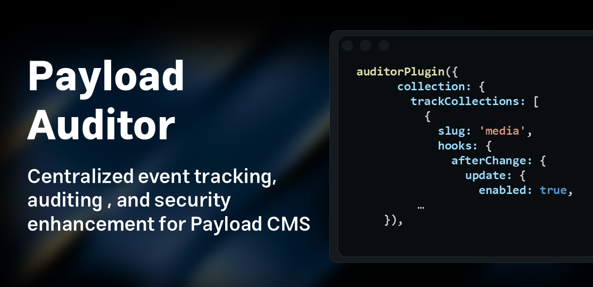

<p align="center">
  
</p>


[](https://bundlephobia.com/package/payload-auditor)


# 📦 Payload Auditor

**Payload Auditor** is a powerful plugin for [Payload CMS](https://payloadcms.com) that provides centralized **event tracking, auditing, and security enhancements**. This tool is designed for developers and teams looking to monitor critical actions, analyze user behaviors, and enhance backend security within their Payload projects.

📊 Only **~2 kB** (minified + gzipped) and has **no external dependencies**.

## ⚙️ Installation & Usage

Install with your preferred package manager:

```bash
npm install payload-auditor

# or

pnpm add payload-auditor

# or

yarn add payload-auditor
```

Then, register the plugin in your Payload config:

```ts
import { auditorPlugin } from 'payload-auditor'

export default buildConfig({
  plugins: [
    auditorPlugin({
      // your plugin config here
    }),
  ],
})
```

## 🔧 Plugin Options

The plugin is designed in a way that allows you to customize it deeply. Of course, the project is fully documented and you can use its documentation well during development.

Customize the plugin with the following configuration(for example):

```ts
auditorPlugin({
  automation: {
    logCleanup: {
       cronTime: '* * * * *', // every minute
       queueName: 'john-doe-queue',
    },
  },
  collection: {
    trackCollections: [
      {
        slug: "media",
        hooks: {
          afterChange: {
            update: {
              enabled: true,
            },
          },
        },
      },
    ],
  },
});
```

## ✨ **Things you can customize:**

- 🔒 **You can control the accessibility of logs.** Due to the increased security of the plugin, other operations are not available.

- 🛠️ **You can manage how logs are injected into the database.**

- 🏷️ **You can customize all the plugin's built-in collection values.**

- 📊 **You can specify which collections you want to track.**

## ✨ **How to customize logging for each collection:**

For logging, we have integrated the entire plugin with **Payload CMS hooks** for each collection that you allow tracking, so you can **track the entire application**. **payload-auditor** does logging **not based on the hooks themselves, but on the operations inside each hook**. Reading the collection hooks documentation can give you a much better understanding of how the plugin works.

🔍 **In summary, for each collection, you can make the following changes:**

- 🏷️ **Set the collection slug you want.** This is the basis for tracking, which makes the plugin find your collection.
- ⚙️ **Enable the required hooks.** As mentioned, this plugin supports all Payload CMS hooks.
- 🔄 **Enable custom operations in each hook.** Maybe you need a hook but don't want to use all the operations inside that hook for logging. For example, inside the `afterOperation` hook, only the `create` operation creates a log.
- ⏸️ **You can temporarily stop tracking this collection.**

## 🧠 When Should You Use It?

- You need to track critical collection changes (e.g., user logins, updates)

- You want additional backend security for your Payload project

- You work in a multi-user admin environment with role-specific needs

- You're building a SaaS or enterprise-grade Payload-based product

## 📚 Docutments

Using the plugin is straightforward. Simply specify the slug of the collection or global you want to track, then configure the hooks and operations you need to monitor.

> For quick access to the documentation, simply hover over the main API. You can then use the provided link to navigate directly to the relevant documentation.

### `automation`

Configures the automation features of the plugin.

Currently, the plugin supports **automatic log cleanup** using Payload CMS's Jobs system.

### `collections` & `globals`

These are the core sections of the plugin, managing operation tracking. They share a nearly identical API.

Each has a `track` property that accepts the following configuration:

| Property                             | Description                                                                                |
| ------------------------------------ | ------------------------------------------------------------------------------------------ |
| `hooks`                              | Defines which hooks to track.                                                              |
| `hooks["hookName"]`                  | The hook name to track. Can be `true` or a configuration object.                           |
| `hooks["hookName"]["operationName"]` | The operation to track within the specified hook. Can be `true` or a configuration object. |
| `slug`                               | The slug of the `collection` or `global`. This value is type-safe.                         |

#### Important Notes:

- At both the **hook level** (`hooks["hookName"]`) and the **operation level** (`hooks["hookName"]["operationName"]`), the following properties are always available:

| Property       | Description                                                              |
| -------------- | ------------------------------------------------------------------------ |
| `customLogger` | A custom function to customize the log output.                           |
| `debug`        | Enables debugging for the hook or operation. Can be `true` or an object. |

- When `debug: true` is enabled for a hook or operation, logs are **not saved to the database** by default. To override this behavior, set `debug.skipDatabaseSave: false`. The logs will still be displayed in the console.

- If the hook you're tracking does not have operations (e.g., `afterRead` or `afterForgotPassword`), the plugin will treat the second-level key as the operation name. For example, `forgot-password` or `read`.

- When using `customLogger`, ensure you include the necessary internal collection fields (or custom fields) in your output. The `operation` and `hook` values are always overridden by the plugin and are required. The function must return an object.

- An `enabled` property is available at both the hook and operation levels. This allows you to enable or disable tracking for specific hooks or operations.

- Setting a hook or operation to `false` will disable it entirely.

### `buffer`

Configures how logs are flushed to the database. You can control flushing based on either **time** or **log count**.

| Property        | Description                                                                                                                                                                                                                   |
| --------------- | ----------------------------------------------------------------------------------------------------------------------------------------------------------------------------------------------------------------------------- |
| `flushStrategy` | Defines the flushing strategy. Options:<br>- `size`: Flush when the number of logs reaches the specified limit.<br>- `time`: Flush after a specified time interval.<br>- `realTime`: Flush immediately when logs are created. |
| `size`          | A numeric value. When the log count reaches this number, logs are flushed. Works with the `size` strategy.                                                                                                                    |
| `time`          | A numeric value in milliseconds. Logs are flushed at this interval. Works with the `time` strategy.                                                                                                                           |

### `configureRootCollection`

A function that allows you to customize the internal collection.

The function receives the default collection configuration as an argument and expects you to return your modified configuration.

---

## 📄 License

[MIT License](./LICENSE)
