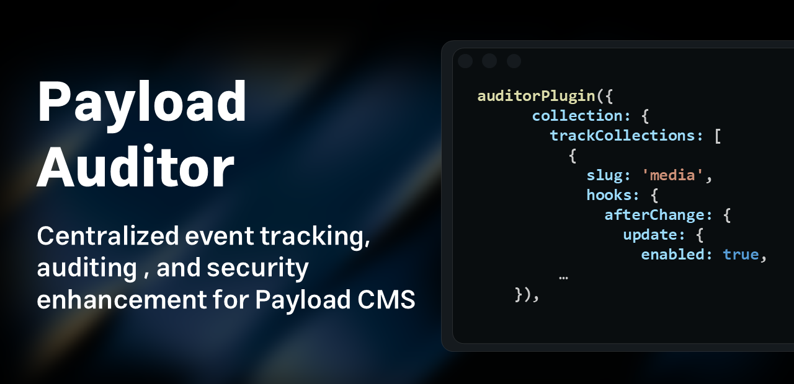

<p align="center">
  
</p>


[](https://bundlephobia.com/package/payload-auditor)


# 📦 Payload Auditor

**Payload Auditor** is a powerful plugin for [Payload CMS](https://payloadcms.com) that provides centralized **event tracking, auditing, and security enhancements**. This tool is designed for developers and teams looking to monitor critical actions, analyze user behaviors, and enhance backend security within their Payload projects.

📊 Only **~3.4 kB** (minified + gzipped) and has **no external dependencies**.

## ⚙️ Installation & Usage

Install with your preferred package manager:

```bash
npm install payload-auditor

# or

pnpm add payload-auditor

# or

yarn add payload-auditor
```

Then, register the plugin in your Payload config:

```ts
import { auditorPlugin } from 'payload-auditor'

export default buildConfig({
  plugins: [
    auditorPlugin({
      // your plugin config here
    }),
  ],
})
```

---

## 🔧 Plugin Options

The plugin is designed in a way that allows you to customize it deeply. Of course, the project is fully documented and you can use its documentation well during development.

Customize the plugin with the following configuration(for example):

```ts
auditorPlugin({
  automation: {
    logCleanup: {
       cronTime: '* * * * *', // every minute
       queueName: 'john-doe-queue',
    },
  },
  collection: {
    trackCollections: [
      {
        slug: "media",
        hooks: {
          afterChange: {
            update: {
              enabled: true,
            },
          },
        },
      },
    ],
  },
});
```

## ✨ **Things you can customize:**

- 🔒 **You can control the accessibility of logs.** Due to the increased security of the plugin, other operations are not available.

- 🛠️ **You can manage how logs are injected into the database.**

- 🏷️ **You can customize all the plugin's built-in collection values.**

- 📊 **You can specify which collections you want to track.**

## ✨ **How to customize logging for each collection:**

For logging, we have integrated the entire plugin with **Payload CMS hooks** for each collection that you allow tracking, so you can **track the entire application**. **payload-auditor** does logging **not based on the hooks themselves, but on the operations inside each hook**. Reading the collection hooks documentation can give you a much better understanding of how the plugin works.

🔍 **In summary, for each collection, you can make the following changes:**

- 🏷️ **Set the collection slug you want.** This is the basis for tracking, which makes the plugin find your collection.
- ⚙️ **Enable the required hooks.** As mentioned, this plugin supports all Payload CMS hooks.
- 🔄 **Enable custom operations in each hook.** Maybe you need a hook but don't want to use all the operations inside that hook for logging. For example, inside the `afterOperation` hook, only the `create` operation creates a log.
- ⏸️ **You can temporarily stop tracking this collection.**

---

## 🧠 When Should You Use It?

- You need to track critical collection changes (e.g., user logins, updates)

- You want additional backend security for your Payload project

- You work in a multi-user admin environment with role-specific needs

- You're building a SaaS or enterprise-grade Payload-based product

---

## 📄 License

[MIT License](./LICENSE)
